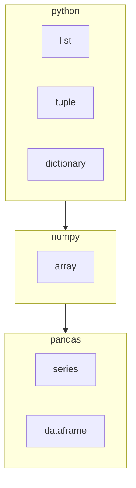

## 파이썬에서 사용하는 자료형

```mermaid
flowchart TD
subgraph sg1[python]
list
tuple
dictionary
end

subgraph sg2[numpy]
array
end

subgraph sg3[pandas]
series
dataframe
end

sg1 --> sg2 --> sg3
```

_\_EOF\__
