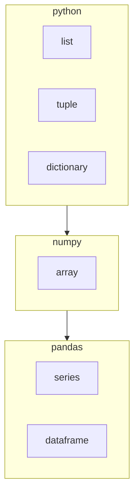

## 파이썬에서 사용하는 자료형

자료형, 데이터 타입(data type)이란 프로그래밍 언어가 데이터를 효율적으로 처리하기 위한 약속이다.

사용하는 패키지에 따라 별도 자료형태를 제공하기도 한다. 아래는 데이터 처리에 있어 흔히 사용되는 numpy와 pandas에서 제공하는 자료형이다.

```mermaid
flowchart TD
subgraph sg1[python]
list
tuple
dictionary
end

subgraph sg2[numpy]
array
end

subgraph sg3[pandas]
series
dataframe
end

sg1 --> sg2 --> sg3
```

_\_EOF\__
